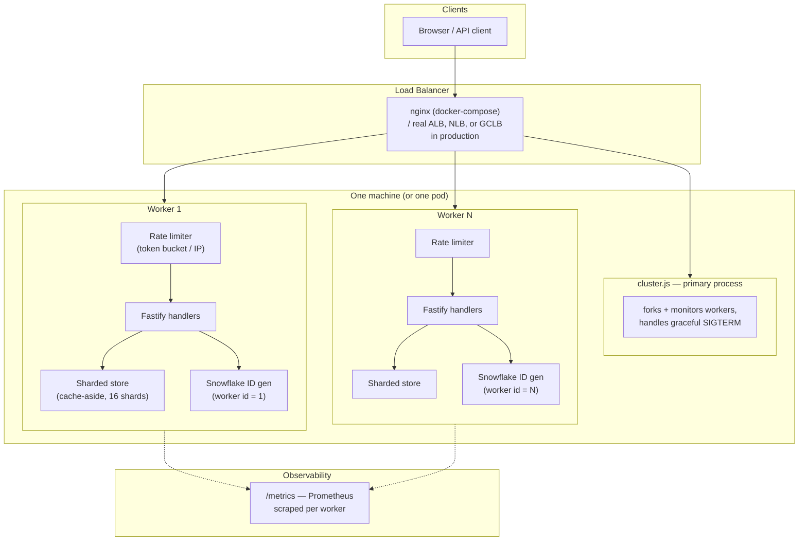

# Scalable URL Shortener

A URL shortener built to actually sustain high read/write throughput, not
just serve as a CRUD demo. It's the classic "design TinyURL" system-design
interview question, implemented with the patterns that question is really
testing: sharded ID generation, cache-aside storage, horizontal scaling via
a shared-nothing process model, backpressure via rate limiting, and
Prometheus-based observability.

**Real, reproducible benchmark: 119,747 req/s average on the read path**
(4-core loopback test, zero errors) — see [BENCHMARK.md](./BENCHMARK.md) for
full numbers and exactly how to reproduce them yourself.

## Why this design

A URL shortener looks simple (two endpoints: shorten, redirect) but hits
every classic scaling problem once you need it to survive real traffic:

- **ID generation is a hotspot.** A single auto-increment counter or a
  single "next ID" service becomes a bottleneck and a single point of
  failure the moment you have more than one app instance. This uses a
  [Snowflake-style](https://en.wikipedia.org/wiki/Snowflake_ID) generator
  (`src/idgen.js`) — each worker mints its own IDs from
  `(timestamp, worker id, sequence)` with zero coordination, so adding more
  workers/instances never causes a collision.
- **Reads dominate writes by orders of magnitude.** People click short
  links far more often than they create them, so the redirect path
  (`GET /:code`) is optimized as the hot path: one cache-aside lookup, and
  the click-count write is fire-and-forget (`setImmediate`, not awaited) so
  analytics writes never add latency to a user-facing redirect.
- **A single hash map/database doesn't scale writes.** Storage
  (`src/store.js`) is partitioned across 16 shards by key hash, each with
  its own bounded LRU cache in front of it — the same shape as sharding a
  real database, just simulated in-process here so the whole thing runs
  with zero external infrastructure.
- **One client shouldn't be able to take the whole service down.** A
  per-client token-bucket rate limiter (`src/rateLimiter.js`) caps burst
  and sustained request rate per IP, independent of overall system load.
- **Horizontal scaling should be "run more of it," not a rewrite.**
  `src/cluster.js` forks one worker per CPU core, each a fully independent,
  shared-nothing Fastify instance. This is the same shape as "N pods behind
  a Kubernetes Service" — scaling from cores to machines is a load-balancer
  change, not a code change.
- **You can't operate what you can't see.** Every request is instrumented
  with Prometheus metrics (`src/metrics.js`): request duration histograms,
  request counts, rate-limit rejections, and cache hit/miss ratio, all
  labeled per worker.

## Architecture



## API

| Method | Path | Description |
|---|---|---|
| `POST` | `/api/shorten` | `{ "url": "https://..." }` → `{ code, shortUrl, deduped }`. Idempotent: resubmitting the same URL returns the existing code instead of minting a new one. |
| `GET` | `/:code` | `302` redirect to the original URL. The hot path. |
| `GET` | `/api/stats/:code` | `{ code, longUrl, clicks }` |
| `GET` | `/health` | Liveness/readiness probe target. |
| `GET` | `/metrics` | Prometheus exposition format. |

## Running it

```bash
npm install

# Multi-core, production-shaped (recommended):
npm start                      # forks one worker per CPU core

# Single process (for the baseline comparison in BENCHMARK.md):
npm run start:single

# Unit tests (id generation, sharding, cache-aside, rate limiter):
npm test

# Load test against a running instance:
npm run benchmark -- 15 200    # 15s duration, 200 connections
```

### Running behind a load balancer locally

```bash
docker compose up --build --scale app=4
# then load-test http://localhost:8080 instead of hitting one instance directly
```

## Scaling beyond one box

This project intentionally runs with zero external infrastructure so it's
trivial to clone and benchmark, but every component has a documented seam
for scaling past a single machine:

- **Cache-aside → shared cache.** `src/store.js`'s per-shard LRU is
  process-local. In a multi-instance deployment, swap it for Redis (or
  Redis Cluster, sharded the same way by key hash) so cache hits are shared
  across every instance instead of duplicated per process.
- **In-memory shards → database partitions.** The 16 in-memory shards map
  directly onto 16 (or N) database partitions/tables, or a sharded
  Postgres/DynamoDB setup keyed the same way — the hashing logic
  (`shardIndexFor`) doesn't change, only what's on the other side of it.
- **Per-process rate limiter → distributed rate limiter.** The current
  limiter protects each process independently. A global limit across all
  instances needs a shared counter (Redis `INCR` + `EXPIRE`, or a
  sliding-window log in Redis) instead of an in-memory `Map`.
- **One load balancer → a real one.** `docker-compose.yml`/`nginx.conf`
  demonstrate the pattern locally; in production this is an ALB/NLB (AWS),
  GCLB (GCP), or an Nginx/Envoy ingress controller in Kubernetes.
- **Redirect caching → a CDN.** `GET /:code` responses are cacheable by a
  CDN edge (Cloudflare, CloudFront) with a short TTL, which removes the
  vast majority of redirect traffic from the origin entirely — the single
  highest-leverage change for a read-heavy service like this one.

## Stack

Node.js + [Fastify](https://fastify.dev/) (chosen for its low per-request
overhead relative to Express, and its wide production use at high-traffic
companies), `prom-client` for metrics, `lru-cache` for the cache-aside
layer, `autocannon` for load testing. No external database or cache is
required to run or benchmark this project — see "Scaling beyond one box"
for how each in-memory piece maps onto real infrastructure.

## License

MIT
